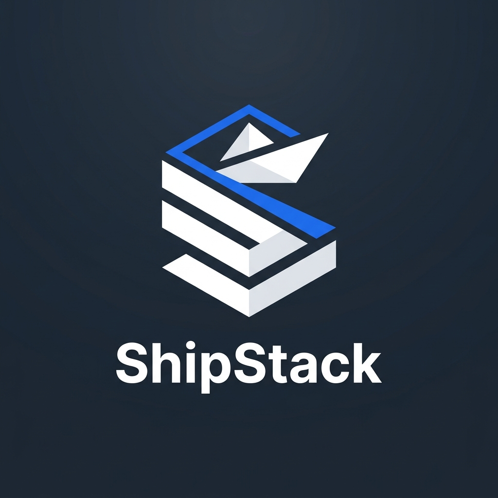

<div align="center">



<p align="center" style="font-size: 64px; letter-spacing: 0.12em; font-weight: 700;">
  ShipStack
</p>

### A Modern Marketplace for Production-Ready Software

Buy. Sell. Ship.

---


</div>

---

## 📖 Overview

ShipStack is a modern software marketplace where verified developers can publish, manage, and sell production-ready software systems while buyers discover, purchase, and download complete applications with licensing, version history, and ongoing updates.

Beyond buying existing software, organizations and businesses can post software requests, allowing developers to submit proposals and build custom solutions.

---

# ✨ Features

### 🛍️ Marketplace

- Browse production-ready software
- Powerful search and filtering
- Categories and technology tags
- Rich product pages
- Version history
- Ratings and reviews

### 👨‍💻 Developer Platform

- Developer verification
- Public storefronts
- Software publishing
- Release management
- Version updates
- Sales management

### 🛒 Buyer Experience

- Secure purchases
- Software ownership
- Download purchased versions
- Update eligibility
- Software request marketplace
- Direct communication with developers

### 🛡️ Administration

- User management
- Marketplace moderation
- Developer verification
- Listing approval
- Audit logging

---

# 🏗️ Tech Stack

| Layer | Technology |
|--------|------------|
| Frontend | React + Vite |
| Styling | Tailwind CSS |
| Backend | Django |
| API | Django REST Framework |
| Authentication | JWT (SimpleJWT) |
| Database | PostgreSQL |
| Cache | Redis |
| Background Tasks | Celery |
| File Storage | Cloudinary |
| Application Server | Gunicorn |
| Hosting | Render |

---

# 📂 Project Structure

```text
shipstack/
│
├── backend/
├── frontend/
├── README.md
```

---

# 🎯 Core Principles

- Specification-driven development
- Modular architecture
- Shared design system
- Scalable backend
- Secure authentication
- Ownership-based authorization
- Incremental feature development
- Clean and maintainable codebase

---

# 🚀 Roadmap

- [ ] Project Initialization
- [ ] Design System
- [ ] Authentication
- [ ] Developer Platform
- [ ] Marketplace
- [ ] Commerce
- [ ] Reviews & Ratings
- [ ] Messaging
- [ ] Software Request Marketplace
- [ ] Dashboards
- [ ] Production Deployment

---

# 📜 License

This project is currently under active development.

A production license will be selected before the first public release.